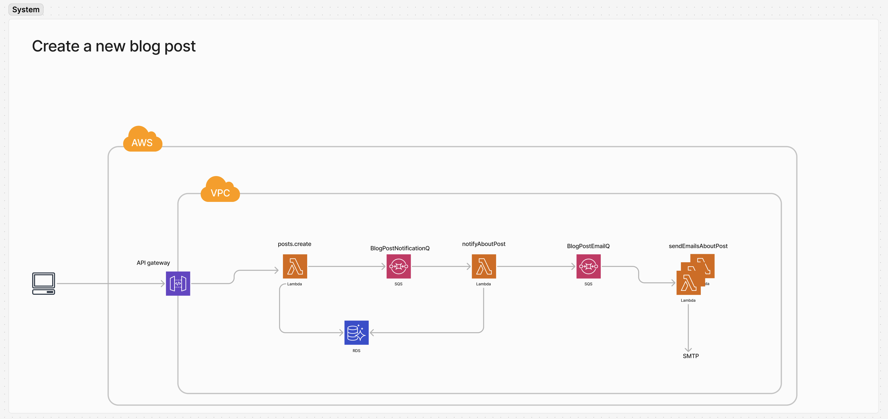

Objective:

Design and implement a scalable system that simulates a Blogging Platform. The platform should allow multiple users to create, update, and delete blog posts, add comments, and follow other users. The system should also include additional features for efficient data handling, API design, caching, event-driven architecture, and frontend-backend integration.

---

Functional Requirements

- Register and log in users to the platform.
- Users should be able to Create, update, and delete blog posts.
- Users should be able to comment on blog posts.
- Users should be able to Search blogs via search filters.
- Users should be able to Follow/Unfollow users.
- When a user creates a blog, a notification should be sent to all the users that follow him.

Non Functional Requirements

- The system should handle high traffic efficiently and scale well.
- The system should be fault tolerant and robust.
- The system should provide a good user experience.

---

Deliverables:

Implement the backend using the language and framework of your choice preferably (NodeJS/Java/GoLang) which includes but not limited to

- Modelling the data accurately.
- Expose the required APIs to perform the functions.
- Implementing repository functions to interact with the database of choice.

Document the decision making process either through comments or in a separate document.
We will be visiting these deliverables during the interview.

---

TODO

- [x] Add a notification system to the project
- [x] Add a search system to the project
- [x] Add a follow system to the project
- [x] update and delete posts
- [x] database migrations

Where we could go next:

- unit and integration tests
- require usage of a provided nonce for signing requests (either via storing it in session or db)
- cleanup sessions table regularly
- separate primary key for users so they can change address, have multiple addresses
- swagger/openapi ui
- Blog frontend
- Allow inline signature of api requests - w/o session but require api body to be signed
- store sent email and dlq messages in db to monitor
